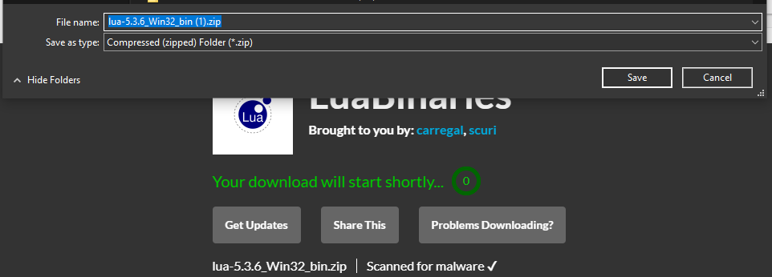
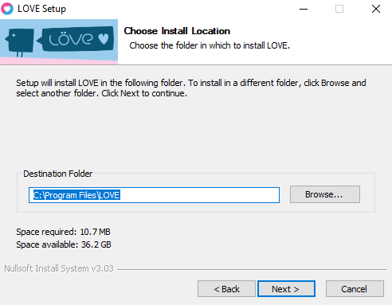

# Installing Lua and LÖVE

Lua is an extremely underrated scripting language with even fewer keywords than
Python. If you're interested in games, you can use it to build your own 2D games
with the LÖVE framework **or** games such as World of Warcraft, ROBLOX, and
Garry's Mod all support Lua.

## Lua

You can try to navigate to [lua.org](https://www.lua.org/start.html) and build
the Lua interpreter from the source code, or you can install the binaries
specific to your system [here](http://luabinaries.sourceforge.net/download.html).

For Windows, click any of the `lua-5.x.x_WinXX_bin.zip` download links to
download your preferred version for your OS (Win32 or Win64). Let SourceForge
get its ad time in and then download to your preferred location.



Then, simply extract the binaries into your preferred location. If you'd like to
be able to run the Lua interpreter from the command line, make a note of the
location and add it to your `PATH` environment variable.

## LÖVE

Love can be built from the [source code](https://github.com/love2d/love) as well
or just visit [love2d.org](https://love2d.org/). If you'd like to build it from
source code on Windows, you must also install `CMake` and follow the
[megasource](https://github.com/love2d/megasource) instructions.

Assuming you downloaded an installer from their website, click through it and
make note of the destination folder.



Navigate to the destination folder and create a desktop shortcut for `love.exe`
so that you can drag game folders over the shortcut and run games.
Alternatively, this can also be added to your `PATH` variable and you can run
games from your working directory with

```shell
love .
```

# INSERT GIF FOR RUNNING GAME HERE

## VSCode

The beauty of using Lua and LÖVE to make 2D games is that you can use any text
editor as LÖVE is just a code framework and not a full game engine. I recommend
using [Visual Studio Code](https://code.visualstudio.com/) as your IDE and
installing extensions for Lua and LÖVE.

You may notice that the global variable `love` is not recognized by VSCode.
There are two ways to remedy this:

1. Hover over one of your calls to love and press **Quick fix** or press
   `Ctrl + .` with the cursor inside the word "love". Then select "Mark \`love\` as a
   defined global variable."

2. Alternatively, at the top of any file using love just add the line:

```Lua
local love = require('love')
```

> These steps are not necessary, since we run the game folders with `love.exe`
> these are just to remove the cursed squiggly underline.
