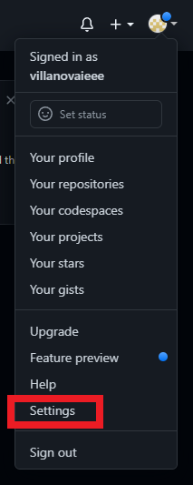
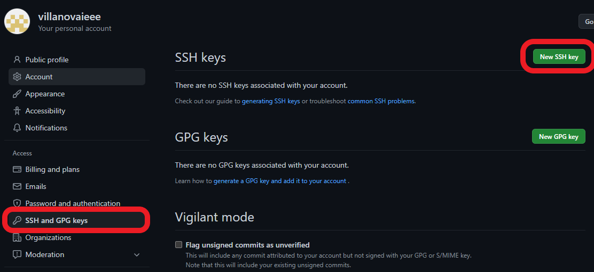

# Linking Git and GitHub

## Account Creation

Sign up for an account on [github.com](https://github.com/).

Configure your local git environment with the info of the account you just
established. If on Windows ensure you are using Git Bash

```bash
git config --global user.name "<GitHub Username>"
git config --global user.email "<GitHub Email>"
```

## Creating SSH Key Pairs

"SSH" stands for "Secure Shell" or "Secure Socket Shell" is a means of granting
access to a machine over a network. For instance, you can "SSH" into a Raspberry
Pi and begin writing code on the Raspberry Pi from your laptop/desktop.

In the world of git, SSH is a protocol that allows for secure communication
between your machine and GitHub so that only you, and registered collaborators,
can make changes to your repositories. This is done by storing a private key on
your machine, and giving GitHub access to the paired public key.

### Generating the Keys

During the installation of git, you should have incldued the bundled SSH
component. In Git Bash (Windows) or Bash (Mac/Linux) you can run

```bash
ssh-keygen -t ed25519 -C "<GitHub Email>"
```

If your machine does not support the ed25519 algorithm, you can run

```bash
ssh-keygen -t rsa -b 4096 -C "<GitHub Email>"
```

Press `Enter` to save the key-pair in the default location: `~/.ssh`. You can
change to this directory with

```bash
cd ~/.ssh
```

Enter a password (or don't).

### Obtaining the Keys

In your hidden `.ssh` directory, there should be two files called `id_ed25519`
and `id_ed25519.pub` assuming you did not change the filepath/name. The
extensionless file is your private key, we need to give GitHub the public key
which is the file with the `.pub` extension. Open it with a text editor (not
Microsoft Publisher) and copy its contents.

If you are in a terminal at the directory `~/.ssh` you can run the command

```bash
cat id_ed25519.pub
```

to spit the contents out to the command line and copy them.

## Linking your Machine and GitHub with SSH Keys

Go to your account's Settings in GitHub and then select the "SSH and GPG keys"
tab.

<div style="text-align:center;">
    
    
</div>

Name the SSH key something fitting. If you have multiple machines
(laptop/desktop), you may want to take that into account. Add the contents of
the `.pub` file to the `Key` box and then click the `Add SSH key` button.

**Congrats!!!** You're finally set up and ready to begin using git and GitHub!
