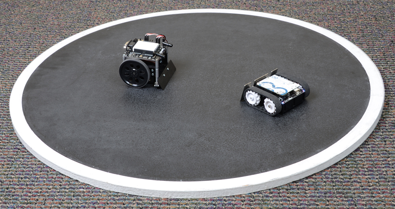

# Sumobot Competition Rules

1. At the beginning of each match, each bot will be placed at opposite edges of
   the circular ring (pictured below). The ring is 1 meter in diameter, is black
   on the interior, and contains a white edge along the perimeter to serve as a
   warning boundary. Upon a countdown of 5 seconds the round begins and each bot
   will be allowed to move about the ring. Once the countdown begins neither bot
   can be touched, adjusted, or controlled by an outside individual.

2. The round will end when one of the bots exits the ring, and is declared the
   loser of the round. If any part of the bot touches the ground outside of the
   ring, or is rendered immobile on the edge, it is considered out.

3. Matches will all be best of three. The competition will be double elimination
   until the Championship Round.

[//]: <> (
you can generate brackets here:
https://challonge.com/tournament/bracket_generator
)

4. Add-ons to your Sumobot are allowed so long as:
   - The length and width dimensions of the Sumobot remain under 6 inches
   - The Sumobot weighs less than 2 pounds.

    

Best of luck in the dohyō!
