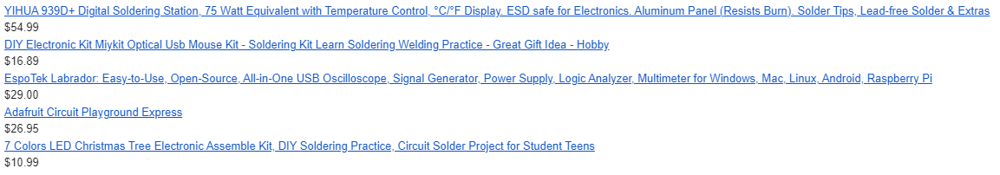
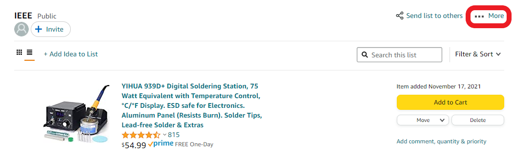
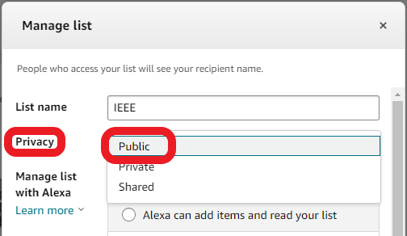
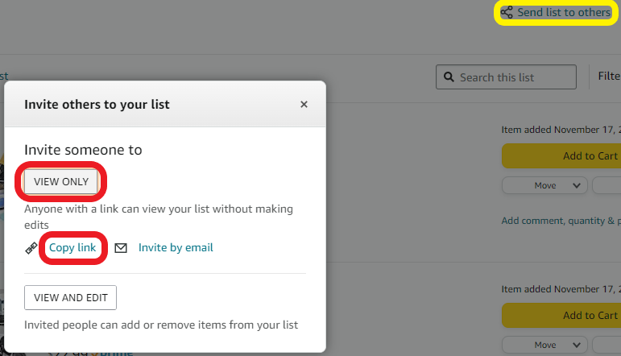

# Christmas Wishlist

This workshop covers automated price updates on an Amazon wishlist

This workshop aims to teach you how to scrape above web pages for data related
to Amazon products. The email functions used in the code are not explained, but
are explained in the files [`email_python.py`](../email_python.py) and
[`email_js.js`](../email_js.js).

The email you will receive will look something like the following:

<div style="text-align:center;">
    
</div>

## Setup

### Wishlist

You must create a **public** Amazon wishlist in order to scrape it. To do so, navigate to your desired wishlist on Amazon and click the **...More** hyperlink.

<div style="text-align:center;">
    
</div>

Click the **Manage list** hyperlink and then set the **Privacy** of the list to **Public**.

<div style="text-align:center;">
    
</div>

Lastly, click the **Send list to others** hyperlink, click the **VIEW ONLY**
button and the **Copy link** hyperlink. You know have the link you will fetch
and scrape!

<div style="text-align:center;">
    
</div>

### Software

> :exclamation: If you do not have python or NodeJS installed, reference the
> installation guide in the [INSTALLS.md](../INSTALLS.md) file. Also feel free
> get a brief background in web scraping through the [SCRAPE.md](../SCRAPE.md)
> file.

This workshop uses `cheerio` and `beautifulsoup` to access web pages.

cheerio can be installed by running, within your project directory:

```shell
npm i cheerio
```

Beautiful soup can be installed by running:

```shell
pip install beautifulsoup4
```

## Using Environment Variables

To keep your email and password secure, it is recommended to use a `.env` file
which can be referenced outside of your code. Simply create a `.env` file just
like the [`example.env`](../example.env) file.

## License

All workshops for the Villanova Chapter of IEEE (all code within this
repository and specifically this web scraping workshop) are licensed under the
[GNU General Public License v3.0](https://www.gnu.org/licenses/lgpl-3.0.en.html), also included within the [`COPYING`](https://github.com/davisgriffin/IEEE_Workshops/blob/main/COPYING) file.
