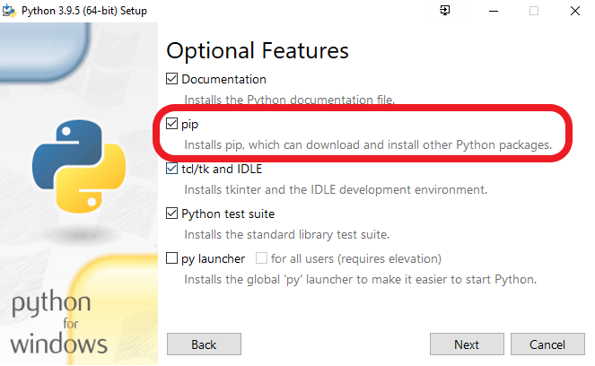
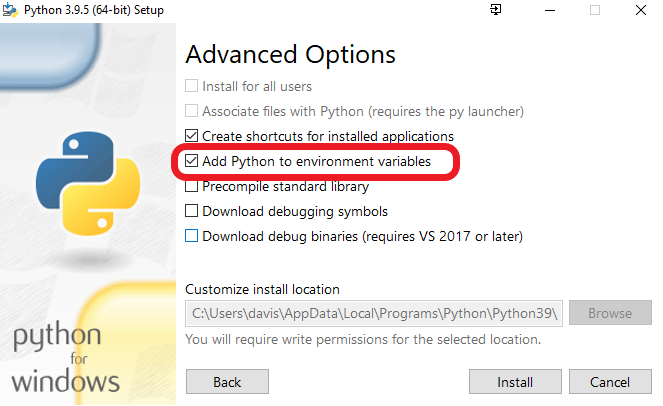
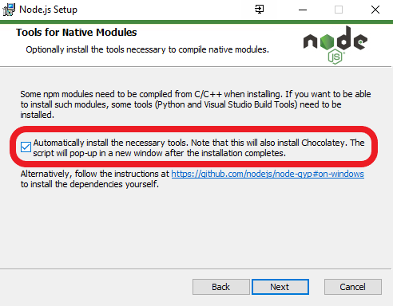

# Installing Python and NodeJS

If you don't already have NodeJS or Python installed, here are some brief
instructions on how to do so:

## Python

The download page for Python can be found [here](https://www.python.org/downloads/).

Once you have downloaded the installer, run it and ensure the following:

1. You check to install `pip`, Python's package manager:

   

2. You check to add Python to your environment variables:

   

Following these simple steps should allow you to run the following commands in a
<u>new</u> terminal and receive the version numbers of your installs:

```shell
> python --version
Python 3.10.2

> pip --version
pip 21.2.4 from C:\Python310\lib\site-packages\pip (python 3.10)
```

You can browse Python packages on [pypi.org](https://www.pypi.org/) which will
include the command to install them, or if you know the package you'd like to
install just run `pip install <package>`.

## NodeJS

There are two methods to install `nodejs` and its package manager `npm`. We will
cover the basic install first, but I would recommend following the section on
[installing nvm](), the node version manager, in the next section.

The reason we need `node` is because JavaScript is an interpreted language that
can only be run in internet browsers. Node allows us to run .js files locally.

1. Download the LTS version of node and npm [here](https://nodejs.org/en/download/).
2. You can click through the installer BUT make sure you check the box to
   automatically install the necessary tools.

   

3. When the command window appears to install the additional tools, press a key
   to continue to the next step.

Following these simple steps should allow you to run the following commands in a
<u>new</u> terminal and receive the version numbers of your installs:

```shell
> node -v
v17.4.0

> npm -v
8.3.1
```

You can browse NodeJS packages on [npmjs.com](https://www.npmjs.com/) which will
include the command to install them, or if you know the package you'd like to
install just run `npm i <package>`.

## Node Version Manager (NVM)

> :warning: Make sure to uninstall NodeJS and npm if already installed
> **before** installing nvm

`nvm` is an extremely useful tool and the optimal way to download NodeJS and npm
as it will allow you to easily update versions with just two commands in the
future (rather than having to uninstall node and update by downloading the LTS).

### Mac/Linux Install

Go to the installation section of nvm's [GitHub](https://github.com/nvm-sh/nvm#installing-and-updating)
for the latest script that installs nvm for Mac or Linux. It should look
something like:

```shell
curl -o- https://raw.githubusercontent.com/nvm-sh/nvm/v0.39.1/install.sh | bash
```

If you get an error that the `curl` command is not recognized, try the `wget`
command or look into installing cURL on your system.

### Windows Install

Goto the [releases](https://github.com/coreybutler/nvm-windows/releases) of
`nvm-windows` by coreybutler on GitHub. Download the `nvm-setup.zip` file of the
latest release and unzip it on your machine. Run the `nvm-setup.exe` executable
to begin installation. Click through the installer.

### Installing NodeJS with nvm

Open a <u>new</u> terminal and run the following command to test the install:

```shell
> nvm version
1.1.9
```

If you receive the version number you are ready to install NodeJS and npm. To
install the latest version of node run:

```shell
> nvm install latest # on Mac/Linux: nvm install node
> nvm use latest # on Mac/Linux: nvm use node
```

The latest version should now be installed and active. Say you need to use an
older version of node for compatability. Let's say v16.13.2 Run:

```shell
> nvm install 16.13.2 # or nvm install 16 as this is the latest v16
> nvm use 16.13.2
```

To view installed versions of node:

```shell
> nvm list # on Mac/Linux: nvm ls
```

It is now that easy to update and switch between versions of node. Get working!

## License

All workshops for the Villanova Chapter of IEEE (all code within this
repository and specifically this web scraping workshop) are licensed under the
[GNU General Public License v3.0](https://www.gnu.org/licenses/lgpl-3.0.en.html), also included within the [`COPYING`](https://github.com/davisgriffin/IEEE_Workshops/blob/main/COPYING) file.
