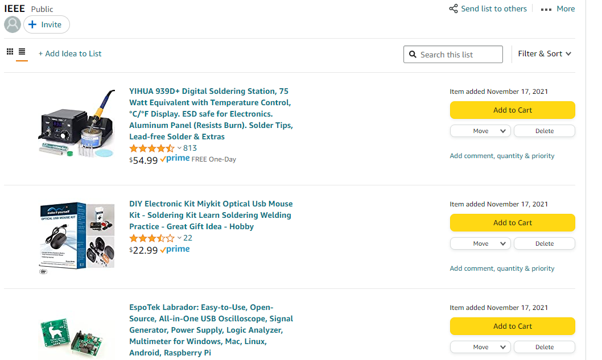
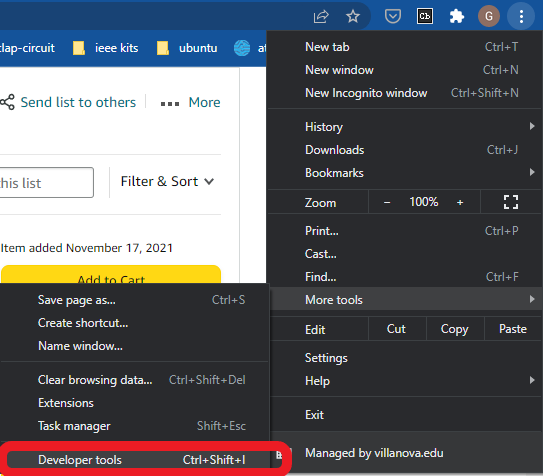
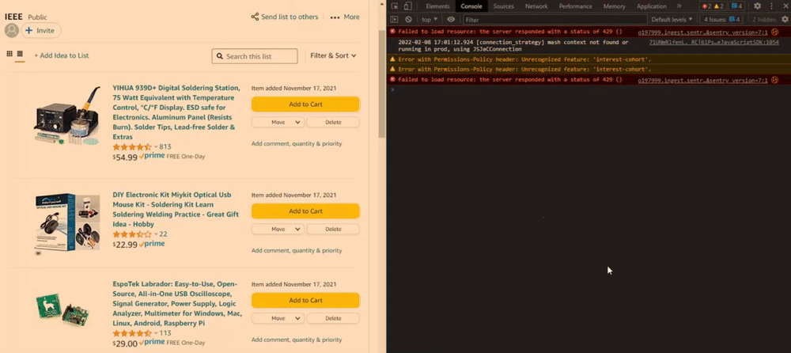

# How to Scrape Data

If you've looked into any of the code files, you'll notice that we find data by
"selecting" (via xpath or a CSS selector) html elements. Once we have the
reference to an html element, we grab the text or content within it.

So the question remains: **How do we come up with these selectors?**

We will explore this question using Google Chrome's inspector. Open up an
instance of Chrome and navigate to a page you would like to scrape. For this
example we will use an Amazon wishlist.

<div style="text-align:center;">
    
</div>

We will use the developer tools to inspect the elements on the web page. You can
access the developer tools by pressing `Ctrl + Shift + I` or by clicking the
three dots in the top right, going to **More tools** and then **Developer tools**.

<div style="text-align:center;">
    
</div>

First things first we need to get each individual entry on our wishlist. Using
`Ctrl + Shift + C` or clicking the pointer icon in the top left of the developer
tools will allow you to select elements on the page. Select the first item on
the wishlist.

<div style="text-align:center;">
    
</div>

We can now scroll up through the HTML markup to look for the `div` tag that
wraps all individual list items. In our case it is a `ul` tag, or unordered list.

Inside the `ul` tag we see multiple `li` (list item) tags. Some of them contain
the items on our wishlist while others contain filler code. We must pick out
what is unique about the `li` tags with our items compared to the filler code.

<div style="text-align:center;">
    
</div>

Studying this image we know we can pick out our **unordered list** by selecting
a `ul` tag with `id="g-items"`.

To get our list items, we could select all `li` tags within the `ul`, or all
`li` tags with `class="a-spacing-none"` within the list, but it would return
some `li` elements we don't want to work with. So we will find all `li` tags
with `class="g-item-sortable"`.

## Python

In Python this can be done using `Selenium` or `Beautiful Soup`.

#### Selenium

```python
ul = driver.find_element(By.CSS_SELECTOR, '#g-items')
li_elements = ul.find_elements(By.CSS_SELECTER, '.g-item-sortable')
```

You then just need to loop over the elements and find the price, titles, links,
and whatever else you would like to scrape.

```python
for li in li_elements:
    ...
```

#### Beautiful Soup

We combine `li_elements=...` and the `for` loop into one line here.

```python
ul = soup.find(id="g-items")
for li in ul.find_all("li", {"class": "g-item-sortable"}):
    ...
```

## NodeJS

In JavaScript this can be done using `cheerio` or `puppeteer`.

#### Cheerio

```javascript
const $ = cheerio.load(html)
$('#g-items li.g-item-sortable').each((i, li) => {
    ...
})
```

#### Puppeteer

```javascript
const [ul] = await page.$('#g-items')                 // $ = querySelector
const [li_elements] = await ul.$$('.g-item-sortable') // $$ = querySelectorAll
for( const li of li_elements) {
    ...
}
```

## License

All workshops for the Villanova Chapter of IEEE (all code within this
repository and specifically this web scraping workshop) are licensed under the
[GNU General Public License v3.0](https://www.gnu.org/licenses/lgpl-3.0.en.html), also included within the [`COPYING`](https://github.com/davisgriffin/IEEE_Workshops/blob/main/COPYING) file.
