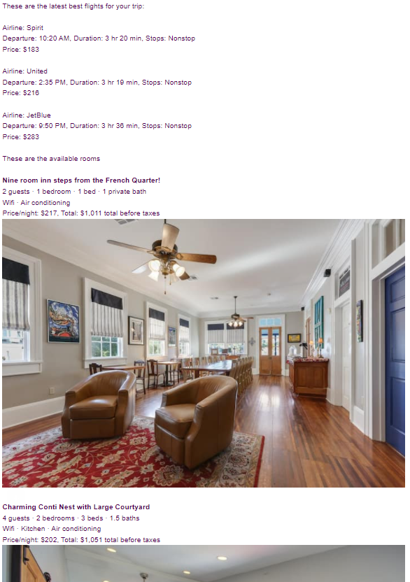

# Spring Break Planning

> :movie_camera: Demonstration using Python can be found on [YouTube](https://www.youtube.com/watch?v=yEsqiKR4i0c).

This workshop covers automated spring break planning by web scraping Google
Flights and airbnb for flights and properties to/at the travel destination of
your dreams.

This workshop aims to teach you how to scrape above web pages for data related
to flights and properties. The email functions used in the code are not
explained, but are explained in the files [`email_python.py`](../email_python.py)
and [`email_js.js`](../email_js.js)

The email you will receive will look something like the following:

<div style="text-align:center;">
    
</div>

## Setup

> :exclamation: If you do not have python or NodeJS installed, reference the
> installation guide in the [INSTALLS.md](../INSTALLS.md) file. Also feel free
> get a brief background in web scraping through the [SCRAPE.md](../SCRAPE.md)
> file.

This workshop uses `puppeteer` and `selenium` to access web pages. These
libraries are used over a conventional `request` because Google Flights serves
their web pages dynamically via JavaScript frameworks. A simple request would
only return boiler plate html and not the data we need to scrape.

Puppeteer can be installed by running, within your project directory:

```shell
npm i puppeteer
```

Selenium can be installed by running:

```shell
pip install selnium
```

Puppeteer is packaged with a version of `chromium`, so it can run Google Chrome
out of the box. Selenium requires a reference to `chromedriver.exe`. You will
need to download chromedrive from the [chromium download page](https://chromedriver.chromium.org/downloads)
and make note of where you unzip the executable into. You will need to reference
the location in your code.

## Using Environment Variables

To keep your email and password secure, it is recommended to use a `.env` file
which can be referenced outside of your code. Simply create a `.env` file just
like the [`example.env`](../example.env) file.

## License

All workshops for the Villanova Chapter of IEEE (all code within this
repository and specifically this web scraping workshop) are licensed under the
[GNU General Public License v3.0](https://www.gnu.org/licenses/lgpl-3.0.en.html), also included within the [`COPYING`](https://github.com/davisgriffin/IEEE_Workshops/blob/main/COPYING) file.
